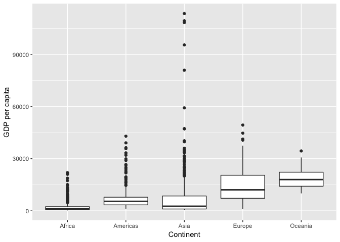

hw02-CarolineSeip
================
Caroline
September 18, 2018

Bring regular data in
=====================

Start by installing and loading the gapminder dataset and tidyverse. If you already have these installed, just load them using the 'library' function.

``` r
library(gapminder)
library(tidyverse)
```

    ## ── Attaching packages ──────────────────────────── tidyverse 1.2.1 ──

    ## ✔ ggplot2 3.0.0     ✔ purrr   0.2.5
    ## ✔ tibble  1.4.2     ✔ dplyr   0.7.6
    ## ✔ tidyr   0.8.1     ✔ stringr 1.3.1
    ## ✔ readr   1.1.1     ✔ forcats 0.3.0

    ## ── Conflicts ─────────────────────────────── tidyverse_conflicts() ──
    ## ✖ dplyr::filter() masks stats::filter()
    ## ✖ dplyr::lag()    masks stats::lag()

Smell test the data
===================

First let's figure out what class the data is, using the 'class' function.

``` r
class(gapminder)
```

    ## [1] "tbl_df"     "tbl"        "data.frame"

This tells us that the class of the gapminder dataset is a tibble dataframe.

How many columns does the gapminder dataset contain? Use the function 'ncol'

``` r
ncol(gapminder)
```

    ## [1] 6

The gapminder dataset contains 6 columns.

How many rows does the gapminder dataset contain? Use the function 'nrow'

``` r
nrow(gapminder)
```

    ## [1] 1704

The gapminder dataset contains 1704 rows.

Or you can use the 'dim' function, which will give you the dimensions of your dataset, telling you the number of rows and columns using only one function.

``` r
dim(gapminder)
```

    ## [1] 1704    6

The gapminder dataset contains 1704 rows and 6 columns.

We can find the type of each variable one by one using the 'class' function:

``` r
class(gapminder$country)
```

    ## [1] "factor"

``` r
class(gapminder$gdpPercap)
```

    ## [1] "numeric"

Or we can get them all at the same time using the 'lapply' function:

``` r
lapply(gapminder, class)
```

    ## $country
    ## [1] "factor"
    ## 
    ## $continent
    ## [1] "factor"
    ## 
    ## $year
    ## [1] "integer"
    ## 
    ## $lifeExp
    ## [1] "numeric"
    ## 
    ## $pop
    ## [1] "integer"
    ## 
    ## $gdpPercap
    ## [1] "numeric"

Explore individual variables
============================

Quantitative variable: population
---------------------------------

To find the range of possible values for a quantitative variable, we can use the 'range' function:

``` r
range(gapminder$pop)
```

    ## [1]      60011 1318683096

This tells us that all values for the quantitative variable 'population' are between 60,011 and 1,318,683,096.

Categoirical variable: continent
--------------------------------

To find the possible values for a categorical variable, we can use the 'unique' function:

``` r
unique(gapminder$continent)
```

    ## [1] Asia     Europe   Africa   Americas Oceania 
    ## Levels: Africa Americas Asia Europe Oceania

This shows us the 6 different possible values for the categorical variable 'continent'.

To find the typical values (mean, median), spread, and distribution of each variable in a dataset, we can use the 'summary' function:

``` r
summary(gapminder)
```

    ##         country        continent        year         lifeExp     
    ##  Afghanistan:  12   Africa  :624   Min.   :1952   Min.   :23.60  
    ##  Albania    :  12   Americas:300   1st Qu.:1966   1st Qu.:48.20  
    ##  Algeria    :  12   Asia    :396   Median :1980   Median :60.71  
    ##  Angola     :  12   Europe  :360   Mean   :1980   Mean   :59.47  
    ##  Argentina  :  12   Oceania : 24   3rd Qu.:1993   3rd Qu.:70.85  
    ##  Australia  :  12                  Max.   :2007   Max.   :82.60  
    ##  (Other)    :1632                                                
    ##       pop              gdpPercap       
    ##  Min.   :6.001e+04   Min.   :   241.2  
    ##  1st Qu.:2.794e+06   1st Qu.:  1202.1  
    ##  Median :7.024e+06   Median :  3531.8  
    ##  Mean   :2.960e+07   Mean   :  7215.3  
    ##  3rd Qu.:1.959e+07   3rd Qu.:  9325.5  
    ##  Max.   :1.319e+09   Max.   :113523.1  
    ## 

To get the typical values for each variable individually we can use the 'mean' function:

``` r
mean(gapminder$lifeExp)
```

    ## [1] 59.47444

The mean life expectancy is 59.47 years.

To see the spread of each variable individually we can use the 'range' function:

``` r
range(gapminder$lifeExp)
```

    ## [1] 23.599 82.603

The range of life expectancy is between 23.6 and 82.6 years.

Or we can find the minimum and maximum to show the spread:

``` r
min(gapminder$lifeExp)
```

    ## [1] 23.599

``` r
max(gapminder$lifeExp)
```

    ## [1] 82.603

The minimum life expectancy is 23.6 years and the maximum is 82.6 years.

Explore various plot types
==========================

Now let's use plots to visualize how the data in the gapminder dataset looks.

First let's explore the variable 'gdpPercap' by creating a historgram, using the 'geom\_histogram' function of 'ggplot'. We will use 50 bins to start out with a descriptive view of the data.

``` r
ggplot(gapminder, aes(gdpPercap)) +
  geom_histogram(bins=50)
```

 This gives a descriptive visualization of the dataset where we can see most of the data points have a GDP per capita of less than 15,000. Very few are over 30,000.

Let's see what it would look like if we chose only 5 bins:

``` r
ggplot(gapminder, aes(gdpPercap)) +
  geom_histogram(bins=5)
```

 This is much less descriptive visualization of the dataset. We can tell that most of the values are low, but not much more than that.

Now we will look at how GDP per capita varies by continent using a boxplot, using the 'geom\_boxplot' function in ggplot. We can also add x and y labels using 'xlab' and 'ylab'.

``` r
ggplot(gapminder, aes(continent, gdpPercap)) +
  geom_boxplot() + 
  xlab("Continent") +
  ylab("GDP per capita")
```

 This shows us the range of GDPs per capita for each continent, but isn't very descriptive of the data.

Now let's use a violin plot (geom\_violin) to see if this gives us a more descriptive visualization of the data:

``` r
ggplot(gapminder, aes(continent, gdpPercap)) +
  geom_violin() + 
  xlab("Continent") +
  ylab("GDP per capita")
```

 This shows us the distribution of data points for GDP per capita for each continent. It is much more descriptive in showing how many data points are at each level.

Now let's use a scatterplot to see how life expectancy and GDP per capita relate to each other:

``` r
ggplot(gapminder, aes(lifeExp, gdpPercap)) +
geom_point() +
  xlab("Life expectancy (years)") +
  ylab("GDP per capita")
```

 It looks like life expectancy rises with GDP per capita. It also looks like this is a logarithmic relationship, let's put it on a log scale to better visualize the relationship:

``` r
ggplot(gapminder, aes(lifeExp, log(gdpPercap))) +
geom_point() +
  xlab("Life expectancy (years)") +
  ylab("Log of GDP per capita")
```

 Now we can really see that life expectancy increases logarithmicly with GDP per capita.

Use filter, select and piping
=============================

We can also select only certain variables to display or work with, using the 'select' function:

``` r
select(gapminder, country, year, lifeExp)
```

    ## # A tibble: 1,704 x 3
    ##    country      year lifeExp
    ##    <fct>       <int>   <dbl>
    ##  1 Afghanistan  1952    28.8
    ##  2 Afghanistan  1957    30.3
    ##  3 Afghanistan  1962    32.0
    ##  4 Afghanistan  1967    34.0
    ##  5 Afghanistan  1972    36.1
    ##  6 Afghanistan  1977    38.4
    ##  7 Afghanistan  1982    39.9
    ##  8 Afghanistan  1987    40.8
    ##  9 Afghanistan  1992    41.7
    ## 10 Afghanistan  1997    41.8
    ## # ... with 1,694 more rows

This selects the variables 'country', 'year', and 'life expectancy'.

Using the 'filter' function allows us to show only the rows of data that we want to see, for example if we want to only see the rows that have a life expectancy below 30:

``` r
filter(gapminder, lifeExp<30)
```

    ## # A tibble: 2 x 6
    ##   country     continent  year lifeExp     pop gdpPercap
    ##   <fct>       <fct>     <int>   <dbl>   <int>     <dbl>
    ## 1 Afghanistan Asia       1952    28.8 8425333      779.
    ## 2 Rwanda      Africa     1992    23.6 7290203      737.

This only shows the rows for Afghanistan in 1952 and Rwanda in 1992, the two instances in which the average life expectancy was below 30.

Piping uses the symbols %&gt;% to mean "then". For example, this shows use gapminder, THEN filter life expectancy for less than 30 years.

``` r
gapminder %>%
  filter(lifeExp<30)
```

    ## # A tibble: 2 x 6
    ##   country     continent  year lifeExp     pop gdpPercap
    ##   <fct>       <fct>     <int>   <dbl>   <int>     <dbl>
    ## 1 Afghanistan Asia       1952    28.8 8425333      779.
    ## 2 Rwanda      Africa     1992    23.6 7290203      737.

Using piping means that we can string several functions together, using the output from one function for the input of the next. This makes the code more simple and avoids long, messy strings of functions within each other.

We can use this to make a graph of only the data we want to see. For instance let's make a graph of life expectancy vs log of GDP per capita using only data from Canada:

``` r
gapminder %>%
  filter(country=="Canada") %>% 
  ggplot(aes(lifeExp, log(gdpPercap))) +
  geom_point() +
  xlab("Life expectancy (years)") +
  ylab("Log of GDP per capita")
```

 Here we used filtering, piping and the 'geom\_point' function in 'ggplot' to show the increasing logarithmic trend of life expectancy with GDP per capita in Canada.

But I want to do more!
======================

Let's see whether this code works:

``` r
filter(gapminder, country == c("Rwanda", "Afghanistan"))
```

    ## # A tibble: 12 x 6
    ##    country     continent  year lifeExp      pop gdpPercap
    ##    <fct>       <fct>     <int>   <dbl>    <int>     <dbl>
    ##  1 Afghanistan Asia       1957    30.3  9240934      821.
    ##  2 Afghanistan Asia       1967    34.0 11537966      836.
    ##  3 Afghanistan Asia       1977    38.4 14880372      786.
    ##  4 Afghanistan Asia       1987    40.8 13867957      852.
    ##  5 Afghanistan Asia       1997    41.8 22227415      635.
    ##  6 Afghanistan Asia       2007    43.8 31889923      975.
    ##  7 Rwanda      Africa     1952    40    2534927      493.
    ##  8 Rwanda      Africa     1962    43    3051242      597.
    ##  9 Rwanda      Africa     1972    44.6  3992121      591.
    ## 10 Rwanda      Africa     1982    46.2  5507565      882.
    ## 11 Rwanda      Africa     1992    23.6  7290203      737.
    ## 12 Rwanda      Africa     2002    43.4  7852401      786.

Hmm, seems like there is some missing data. Because we made a series out of the two countries, data for overlapping years did not show up. Data for Afghanistan is only shown for years ending in 7, and data for Rwanda is only shown for years ending in two.

Instead, let's try using or ("|") to filter the data of the two countries:

``` r
filter(gapminder, country == "Rwanda" | country=="Afghanistan")
```

    ## # A tibble: 24 x 6
    ##    country     continent  year lifeExp      pop gdpPercap
    ##    <fct>       <fct>     <int>   <dbl>    <int>     <dbl>
    ##  1 Afghanistan Asia       1952    28.8  8425333      779.
    ##  2 Afghanistan Asia       1957    30.3  9240934      821.
    ##  3 Afghanistan Asia       1962    32.0 10267083      853.
    ##  4 Afghanistan Asia       1967    34.0 11537966      836.
    ##  5 Afghanistan Asia       1972    36.1 13079460      740.
    ##  6 Afghanistan Asia       1977    38.4 14880372      786.
    ##  7 Afghanistan Asia       1982    39.9 12881816      978.
    ##  8 Afghanistan Asia       1987    40.8 13867957      852.
    ##  9 Afghanistan Asia       1992    41.7 16317921      649.
    ## 10 Afghanistan Asia       1997    41.8 22227415      635.
    ## # ... with 14 more rows

Now we haven't lost any of the data. Yay!
